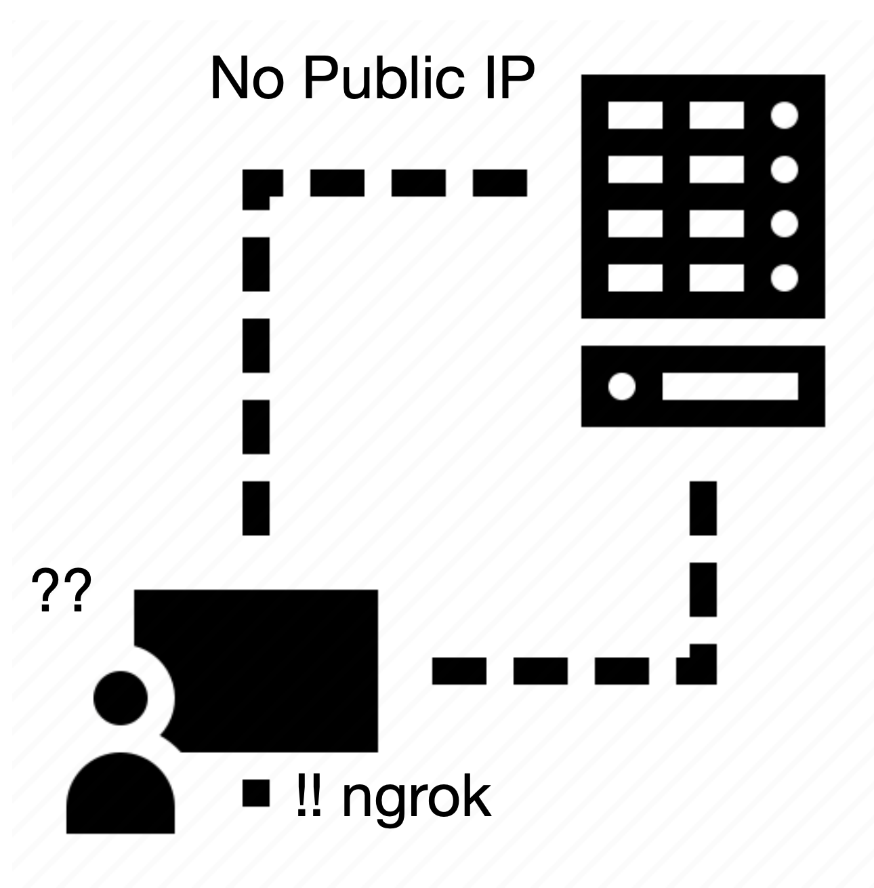

# SSH via ngrok
`Ubuntu환경`에서 ssh 설치 및 사용방법에 대하여 설명하려고 한다. <br/>
만약 web에서 접속할 없는 Public 환경이 구성되지 않았을 경우 어떻게 접속할 수 있는 확인해 보자.
<br/>

<p align="center">
    
</p>

<br/>

## Getting Started

### Install openssh
```bash
./openssh/install.sh
```

### Install ngrok
```bash
./ngrok/install.sh <token>
```

## Notice
아래와 같이 `localhost`로 접속한다면 아래와 같은 경고를 확인할 수도 있다. <br/>
만약 아래와 같은 화면을 본다면, `localhsot` > `127.0.0.1`로 수정해야 한다.
```bash
ssh-ubuntu ssh avikus@localhost -p9999          
@@@@@@@@@@@@@@@@@@@@@@@@@@@@@@@@@@@@@@@@@@@@@@@@@@@@@@@@@@@
@    WARNING: REMOTE HOST IDENTIFICATION HAS CHANGED!     @
@@@@@@@@@@@@@@@@@@@@@@@@@@@@@@@@@@@@@@@@@@@@@@@@@@@@@@@@@@@
IT IS POSSIBLE THAT SOMEONE IS DOING SOMETHING NASTY!
Someone could be eavesdropping on you right now (man-in-the-middle attack)!
It is also possible that a host key has just been changed.
The fingerprint for the ECDSA key sent by the remote host is
SHA256:0l/1OIe+/dXX3oFS58pW6Xi47kQB54J4xgS8jx/pnWU.
Please contact your system administrator.
...
ECDSA host key for [localhost]:9999 has changed and you have requested strict checking.
Host key verification failed.
```
<br/>
해결 방법은 아래와 같다.
```bash
$ ssh avikus@127.0.0.1 -p9999
```


## Reference
- [install ngrok](https://github.com/vincenthsu/systemd-ngrok)

## License
- MIT License
